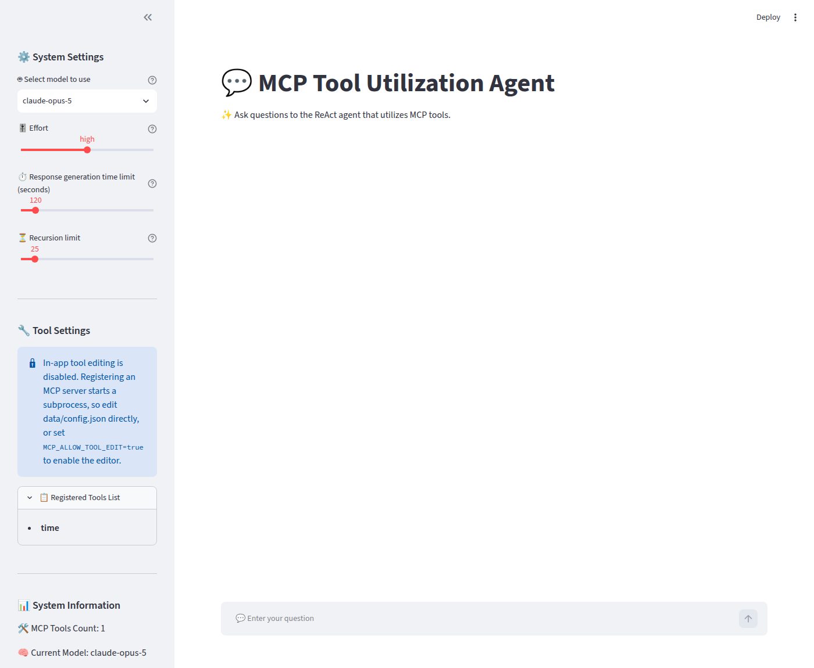

# LangGraph 에이전트 + MCP

[English](README.md)

[](https://github.com/surplus96/Langgraph-MCP-Agent)
[](https://opensource.org/licenses/MIT)
[](https://www.python.org/)

## 프로젝트 개요


`LangChain-MCP-Adapters`는 **LangChain AI**에서 제공하는 툴킷으로, AI 에이전트가 Model Context Protocol(MCP)을 통해 외부 도구 및 데이터 소스와 상호작용할 수 있게 해줍니다. 이 프로젝트는 MCP 도구를 통해 다양한 데이터 소스와 API에 접근할 수 있는 ReAct 에이전트를 배포하기 위한 사용자 친화적인 인터페이스를 제공합니다.

### 특징

- **Streamlit 인터페이스**: MCP 도구가 포함된 LangGraph `ReAct Agent`와 상호작용하기 위한 사용자 친화적인 웹 인터페이스
- **도구 관리**: MCP 서버는 JSON 파일로 설정합니다. 선택적으로 앱 내 편집기
  (`MCP_ALLOW_TOOL_EDIT=true`, 기본값은 꺼짐)를 켜면 Smithery 형식 JSON을 붙여넣어
  추가할 수 있습니다. 어느 쪽이든 프로세스를 재시작하지 않고 에이전트만 다시 만듭니다.
- **스트리밍 응답**: 에이전트 응답과 도구 호출을 실시간으로 확인
- **대화 기록**: 에이전트와의 대화 추적 및 관리

## MCP 아키텍처

MCP(Model Context Protocol)는 세 가지 주요 구성 요소로 이루어져 있습니다.

1. **MCP 호스트**: Claude Desktop, IDE 또는 LangChain/LangGraph와 같이 MCP를 통해 데이터에 접근하고자 하는 프로그램.

2. **MCP 클라이언트**: 서버와 1:1 연결을 유지하는 프로토콜 클라이언트로, 호스트와 서버 사이의 중개자 역할을 합니다.

3. **MCP 서버**: 표준화된 모델 컨텍스트 프로토콜을 통해 특정 기능을 노출하는 경량 프로그램으로, 주요 데이터 소스 역할을 합니다.

## 사전 요구사항

- **Python 3.12+**
- 의존성 관리를 위한 **[uv](https://docs.astral.sh/uv/)**
- **Node.js 18+ 및 npm** — MCP 서버는 보통 `npx`로 실행되므로, 이것이 없으면
  해당 서버는 시작되지 않습니다
- **`ANTHROPIC_API_KEY`**

## Docker 로 빠른 실행

### 필수 요구사항

[Docker Desktop 설치하기](https://www.docker.com/products/docker-desktop/)

### Docker Compose로 실행하기

1. `dockers` 디렉토리로 이동합니다. compose 파일은 `.env`를 자기 자신 기준으로
   찾으므로, `.env`는 저장소 루트가 아니라 이 디렉토리에 있어야 합니다.

```bash
cd dockers
cp .env.example .env
```

2. `dockers/.env`를 채웁니다. `ANTHROPIC_API_KEY`, `USER_ID`, `USER_PASSWORD`는
   필수입니다. 값이 없으면 Compose는 빈 문자열로 대체하지 않고 실행을 거부합니다.
   [환경 변수](#환경-변수)를 참고하세요.

3. 컨테이너를 실행합니다.

```bash
# Intel/AMD (x86_64)
docker compose -f docker-compose.yaml up -d

# Apple Silicon (arm64)
docker compose -f docker-compose.yaml -f docker-compose.arm64.yaml up -d
```

4. <http://localhost:8585> 에 접속합니다.

포트는 `127.0.0.1`에만 바인딩됩니다. 이 애플리케이션은 MCP 서버를 서브프로세스로
실행하므로 직접 노출하면 안 됩니다. 반드시 TLS와 인증을 갖춘 리버스 프록시를
앞에 두십시오.

## 소스코드로 부터 직접 설치

1. 저장소를 클론합니다.

```bash
git clone https://github.com/surplus96/Langgraph-MCP-Agent.git
cd Langgraph-MCP-Agent
```

2. 의존성을 설치합니다. `uv sync`는 `uv.lock`에 고정된 버전을 그대로 설치합니다.

```bash
uv sync
```

3. 예제 파일에서 `.env`를 만들고 값을 채웁니다.

```bash
cp .env.example .env
```

4. 앱을 실행합니다. Streamlit 기본 포트는 **8501** 입니다. Docker 경로와 맞추려면
   `--server.port 8585` 를 넘기세요 — 컨테이너는 Streamlit 을 8585 로 띄우고 그대로
   공개합니다.

```bash
uv run streamlit run app.py --server.port 8585
```

## 환경 변수

| 변수 | 필수 여부 | 기본값 | 용도 |
|---|---|---|---|
| `ANTHROPIC_API_KEY` | 예 | — | 아래 Claude 모델을 사용할 수 있게 합니다. |
| `USE_LOGIN` | 아니오 | `false` | `true`이면 로그인 화면으로 앱을 보호합니다. |
| `USER_ID` | `USE_LOGIN` 시 | — | 로그인 아이디. 비어 있으면 안 됩니다. |
| `USER_PASSWORD` | `USE_LOGIN` 시 | — | 로그인 비밀번호. 비어 있으면 안 됩니다. |
| `MCP_ALLOW_TOOL_EDIT` | 아니오 | `false` | 앱 내 MCP 도구 편집기를 활성화합니다. |
| `MCP_ALLOWED_COMMANDS` | 아니오 | `npx,uvx,node,python,python3,docker` | MCP 서버 `command` 허용 목록. |
| `MCP_CONFIG_PATH` | 아니오 | `config.json` | MCP 서버 설정 파일 경로. |
| `MCP_TOOL_TIMEOUT` | 아니오 | `60` | 툴 호출 하나가 돌 수 있는 시간(밀리초가 아니라 **초**). 사이드바의 턴 제한(60–600초, 기본 120)보다 낮아야 합니다 — 툴 실행 중에 턴 마감이 걸리면 결과 없는 툴 호출이 남아 그 대화가 이후로 못 쓰게 됩니다. 두 값이 충돌하면 앱이 경고합니다. |
| `CHECKPOINT_DB_PATH` | 아니오 | `data/checkpoints.db` | 재시작 후에도 대화가 남도록 저장하는 위치. `:memory:` 로 두면 비활성화됩니다. |
| `PROMPT_CACHE_TTL` | 아니오 | `1h` | 캐시된 프롬프트 프리픽스의 수명. `5m` 또는 `1h`만 유효하며, 다른 값은 경고 후 `1h`로 되돌아갑니다. |
| `LOG_LEVEL` | 아니오 | `INFO` | 파이썬 로깅 레벨. |
| `LANGSMITH_*` | 아니오 | 추적 꺼짐 | 이 애플리케이션이 아니라 LangSmith SDK가 읽습니다. 활성화하면 모든 프롬프트·도구 결과·모델 응답이 외부로 전송됩니다. |

`USE_LOGIN=true`이면서 아이디나 비밀번호가 비어 있으면, 앱은 빈 값 제출을
허용하는 대신 로그인 폼 자체를 표시하지 않습니다.

### 사용 가능한 모델

| 모델 | 최대 출력 토큰 |
|---|---|
| `claude-opus-5` (기본값) | 128,000 |
| `claude-sonnet-5` | 128,000 |
| `claude-haiku-4-5-20251001` | 64,000 |

OpenAI 모델은 현재 연결되어 있지 않습니다. `docs/UPGRADE_PLAN.md`를 참고하세요.

## MCP 도구 설정

MCP 서버는 `MCP_CONFIG_PATH`가 가리키는 파일에서 읽습니다 (기본값 `config.json`,
Docker에서는 마운트된 볼륨 위의 `/app/data/config.json`이므로 컨테이너를 다시
만들어도 유지됩니다). 형식은 `example_config.json`을 참고하세요.

**이 파일은 gitignore 대상이며 반드시 그대로 두어야 합니다** — 실행할 서버의
자격 증명을 담고 있습니다.

MCP 서버를 등록하면 서브프로세스가 실행되므로, 앱 내 편집기는 기본적으로
꺼져 있습니다. 설정 파일을 직접 편집하거나, UI에 접근 가능한 모든 사람을 신뢰할
수 있다면 `MCP_ALLOW_TOOL_EDIT=true`로 설정하세요. 어느 경우든 서버의 `command`
값은 `MCP_ALLOWED_COMMANDS`와 대조하여 검사합니다.

> 파일시스템이나 셸 MCP 서버를 웹 검색·웹 조회 서버와 **같은 에이전트에 함께
> 두지 마십시오.** 검색 도구가 가져온 페이지에 지시문이 심겨 있으면 그것이 셸
> 도구를 움직일 수 있습니다. 공격자가 여러분의 UI에 접근할 필요조차 없는
> 유출 경로입니다.

서버는 [Smithery](https://smithery.ai/)에서 찾을 수 있습니다. 실행 시점에 게시된
코드를 그대로 받아 실행하는 `@latest` 대신 정확한 버전을 고정하세요.

## 개발

```bash
uv sync              # 개발 의존성 포함 설치
uv run ruff check .  # 린트
uv run ruff format . # 포매팅
uv run mypy src/mcp_agent app.py
uv run pytest -q     # 427개 테스트
```

## 사용법

1. 위 안내대로 앱을 실행하고 브라우저에서 엽니다.
2. 사이드바에서 모델을 선택합니다.
3. MCP 도구를 설정합니다 ([MCP 도구 설정](#mcp-도구-설정) 참고).
   - `MCP_ALLOW_TOOL_EDIT=true`로 앱 내 편집기를 켠 경우:
     [Smithery](https://smithery.ai/)에서 원하는 서버를 고르고, 오른쪽 JSON
     구성의 COPY 버튼을 눌러 `Tool JSON` 영역에 붙여넣은 뒤 `Add Tool`을
     누르면 "Registered Tools List"에 추가됩니다.
   - 편집기를 끈 상태라면 설정 파일을 직접 편집합니다.
4. **Apply Settings** 를 눌러 에이전트를 새로 만듭니다. 사이드바에 인식된 도구
   개수와 현재 모델이 표시되고, 시작에 실패한 서버가 있으면 그 이름도 함께
   표시됩니다.
5. 채팅창에서 질문합니다. 도구 호출 내역은 답변 아래 접이식 패널에 표시됩니다.

모델이나 도구 설정을 바꾼 뒤에는 **Apply Settings** 를 다시 눌러야 에이전트가
새 설정으로 다시 만들어집니다.



## 문서

| 문서 | 내용 |
|---|---|
| [docs/ARCHITECTURE.md](docs/ARCHITECTURE.md) | 구성 요소가 어떻게, 왜 그렇게 맞물려 있는지: 이벤트 루프, MCP 세션 수명, 프롬프트 캐싱, 토큰 집계. |
| [docs/MCP_TOOLS.md](docs/MCP_TOOLS.md) | 설정 파일 전체 레퍼런스 — 모든 필드, 검증 규칙, 문제 해결. |
| [SECURITY.md](SECURITY.md) | 위협 모델, 각 통제가 막는 것과 막지 못하는 것, 취약점 신고 방법. |
| [CONTRIBUTING.md](CONTRIBUTING.md) | 개발 환경 설정, 코드 스타일, 이 저장소가 테스트에 요구하는 기준. |
| [CHANGELOG.md](CHANGELOG.md) | 이번 릴리스의 변경 사항. |
| [CLAUDE.md](CLAUDE.md) | 이 저장소에서 AI 코딩 에이전트가 지켜야 할 작업 규약. |
| [docs/UPGRADE_PLAN.md](docs/UPGRADE_PLAN.md) | 이 작업이 따른 현대화 계획과, 의도적으로 미룬 항목. |
| [docs/DESIGN_0.5.0.md](docs/DESIGN_0.5.0.md) | **제안 단계이며 아직 구현되지 않음.** 다음 버전의 오퍼레이션 에이전트 설계와, 승인이 필요한 결정 사항. |

## 라이선스

이 프로젝트는 MIT 라이선스로 배포됩니다. 전문은 [LICENSE](LICENSE)를 참고하세요.

원본 프로젝트: [teddylee777/langgraph-mcp-agents](https://github.com/teddylee777/langgraph-mcp-agents)

## 참고 자료

- https://github.com/langchain-ai/langchain-mcp-adapters

